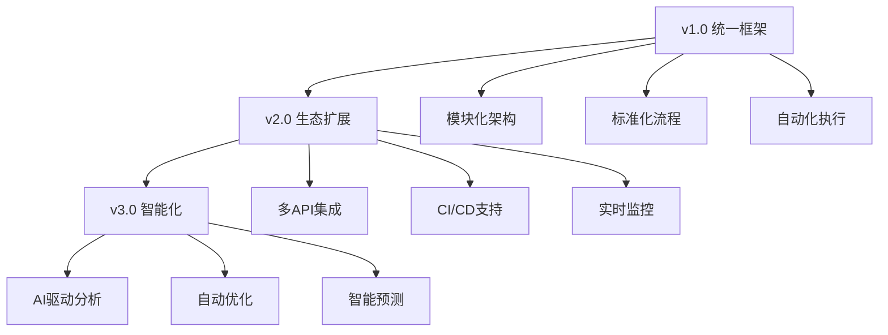

# 统一性能压测自动化框架

## 🎯 框架定位

这是一个**统一的性能压测框架**，基于k6引擎构建，提供标准化的性能验证和压力测试能力。框架设计具备完整的扩展性，可适配任何HTTP API的性能测试需求。

### 核心设计理念
- **统一性**: 标准化的测试策略、指标体系和报告格式
- **扩展性**: 模块化设计，支持快速扩展新的API测试场景  
- **通用性**: 环境无关的配置驱动架构
- **自动化**: 完整的测试执行和报告生成自动化流程

### 当前实现覆盖
- **GodGPT Guest API**: 完整的Guest聊天接口压测实现
- **SSE流式响应**: 专门优化的服务器发送事件压测支持
- **多维度测试**: Baseline/Ramp/Spike三维测试策略
- **智能报告**: 双重报告系统(原始数据+可视化分析)

## 🏗️ 统一架构设计

### 核心模块架构
```
loadtest-automation/
├── 🔧 config/                    # 统一环境配置层
│   ├── env.dev.json              # 开发环境配置 (当前可用)
│   ├── env.prod.json            # 生产环境配置模板 (需自定义)
│   └── test-data.json           # 测试数据配置 (10条冥想相关消息)
├── 🧪 scripts/stress/            # 可扩展压测脚本集合
│   ├── guest-*.js               # Guest API测试套件 (当前实现)
│   ├── [future-api]-*.js        # 未来API测试套件 (扩展位)
│   ├── generate-core-report.js  # 通用报告生成器
│   └── *.sh                     # 批量执行脚本
├── 📊 outputs/                   # K6原始输出目录
├── 📈 reports/                   # HTML报告目录
└── 📋 requirements/             # 测试需求文档库
    └── performance-tests/        # 按API分类的性能需求
        ├── godgpt/              # GodGPT相关需求
        └── [future-apis]/       # 未来API需求 (扩展位)
```

### 技术栈与能力
- **测试引擎**: k6 (高性能负载测试工具)
- **脚本语言**: JavaScript ES6+ (直观的测试脚本开发)
- **配置系统**: JSON驱动的环境配置管理
- **指标系统**: K6内置指标 + 自定义业务指标
- **报告系统**: 双重报告(JSON原始数据 + HTML可视化)
- **架构设计**: 专注核心功能，避免过度抽象

## 🧬 统一测试策略体系

### 三维测试模型 (Universal Testing Dimensions)

所有API测试都遵循统一的三维测试策略：

#### 1. **Baseline 基线测试**
```javascript
// 统一配置模板
scenarios: {
  baseline_test: {
    executor: 'constant-vus',
    vus: 1,              // 单用户基线
    duration: '60s',     // 标准1分钟
  }
}
```
- **目的**: 建立性能基线，验证功能正确性
- **适用**: 所有新API的初始性能验证
- **输出**: 基础性能指标和功能完整性报告

#### 2. **Ramp 阶梯递增测试**
```javascript
// 统一递增模板
scenarios: {
  ramp_test: {
    executor: 'ramping-vus',
    stages: [
      { duration: '30s', target: 50 },   // 第一阶梯
      { duration: '5m', target: 50 },    // 稳定观察
      { duration: '30s', target: 100 },  // 第二阶梯
      { duration: '5m', target: 100 },   // 稳定观察
      // ... 可配置扩展
    ],
  }
}
```
- **目的**: 寻找系统性能拐点和容量边界
- **适用**: 所有需要容量规划的API
- **输出**: 性能拐点分析和扩容建议

#### 3. **Spike 瞬时压力测试**
```javascript
// 统一冲击模板
scenarios: {
  spike_test: {
    executor: 'ramping-vus',
    stages: [
      { duration: '10s', target: 0 },    // 静默期
      { duration: '10s', target: 200 },  // 瞬时冲击
      { duration: '5m', target: 200 },   // 高压维持
      { duration: '10s', target: 0 },    // 快速恢复
    ],
  }
}
```
- **目的**: 验证系统抗冲击能力和弹性恢复
- **适用**: 所有面临突发流量的API
- **输出**: 系统弹性分析和故障恢复能力评估

## 🎯 当前实现 - GodGPT Guest API

### 主要测试接口
1. **`/godgpt/guest/create-session`** - Guest会话创建接口
2. **`/godgpt/guest/chat`** - Guest聊天接口 (支持SSE流式响应)

### 统一性能指标标准
| 指标类型 | 阈值标准 | 验证目的 | 扩展性 |
|---------|---------|---------|---------|
| 平均响应时间 | ≤ 200ms | 用户体验质量 | 可按API调整 |
| P95响应时间 | ≤ 10s | 极端情况响应能力 | 通用标准 |
| 错误率 | ≤ 0.1% | 系统稳定性 | 通用标准 |
| API成功率 | ≥ 99% | 核心功能可用性 | 通用标准 |
| 吞吐量 | 动态测定 | 系统处理能力 | 按需确定 |

## 🔧 核心测试模块

### 测试脚本结构
每个测试脚本都包含：
- 📊 **自定义指标定义**：针对具体API的性能指标
- 🔧 **配置加载**：环境配置和测试数据加载
- 🎯 **测试逻辑**：完整的API测试流程
- ✅ **验证机制**：基于k6原生check()的响应验证

### 智能报告生成器 (`generate-core-report.js`)
- **自适应解析**: 自动识别不同API的测试结果格式
- **标准化指标**: 提取统一的核心性能指标
- **可视化模板**: 通用的HTML报告模板
- **扩展接口**: 支持自定义指标和图表类型

## 🚀 使用指南

### 框架初始化

#### 1. 环境准备
```bash
# 安装k6测试引擎
brew install k6  # macOS
# 或
curl -sSL https://get.k6.io | sudo bash  # Linux

# 验证安装
k6 version
```

#### 2. 环境配置
```bash
# 查看当前开发环境配置
cat config/env.dev.json

# 自定义生产环境配置 (模板已提供)
vim config/env.prod.json

# 查看/自定义测试数据 (已包含10条冥想相关消息)
vim config/test-data.json
```

**📝 重要说明:**
- `env.dev.json`: 已配置GodGPT开发环境，可直接使用
- `env.prod.json`: 提供了模板，需要根据实际生产环境进行配置
- `test-data.json`: 包含10条多样化的冥想对话测试数据

#### 3. 配置验证
```bash
# 验证所有配置文件可以正常加载
node -e "console.log('✅ env.dev.json:', JSON.parse(require('fs').readFileSync('config/env.dev.json', 'utf8')).baseUrl)"
node -e "console.log('✅ env.prod.json:', JSON.parse(require('fs').readFileSync('config/env.prod.json', 'utf8')).baseUrl)"  
node -e "console.log('✅ test-data.json:', JSON.parse(require('fs').readFileSync('config/test-data.json', 'utf8')).messages.length + ' messages loaded')"

# 预期输出示例：
# ✅ env.dev.json: https://station-developer-staging.aevatar.ai/godgptpressure-client/api
# ✅ env.prod.json: https://production-api.example.com/api
# ✅ test-data.json: 10 messages loaded
```

### 当前实现 - Guest API测试

#### 单项测试执行
```bash
# 基线性能测试
k6 run scripts/stress/guest-chat-baseline-test.js
k6 run scripts/stress/guest-create-session-baseline-test.js

# 阶梯压力测试  
k6 run scripts/stress/guest-chat-ramp-test.js
k6 run scripts/stress/guest-create-session-ramp-test.js

# 瞬时冲击测试
k6 run scripts/stress/guest-chat-spike-test.js
k6 run scripts/stress/guest-create-session-spike-test.js
```

#### 批量测试套件
```bash
# 运行完整Guest API测试套件
./scripts/stress/run-all-guest-tests.sh

# 运行完整测试序列（包含智能报告生成）
./scripts/stress/run-complete-test.sh

# 运行参数化Spike测试序列
./scripts/stress/run-spike-sequence.sh "100 200 300" "5m"
```

### 通用测试参数化

#### 环境变量驱动
```bash
# 切换测试环境
ENVIRONMENT=prod k6 run scripts/stress/guest-chat-baseline-test.js

# 自定义并发参数
VUS=50 DURATION=300s k6 run scripts/stress/guest-chat-ramp-test.js

# 多参数组合
ENVIRONMENT=dev VUS_COUNT=100 TEST_DURATION=10m k6 run scripts/stress/guest-create-session-spike-test.js
```

## 🔧 框架扩展指南

### 新增API测试的标准流程

#### 1. 创建测试脚本
```bash
# 按统一命名规范创建新API测试脚本
# [api-name]-[test-type]-test.js

# 示例：用户认证API
touch scripts/stress/user-auth-baseline-test.js
touch scripts/stress/user-auth-ramp-test.js  
touch scripts/stress/user-auth-spike-test.js
```

#### 2. 配置环境参数
```json
// config/env.dev.json 扩展示例
{
  "baseUrl": "https://api.example.com",
  "userAuth": {
    "endpoint": "/auth/login",
    "testCredentials": {
      "username": "test@example.com",
      "password": "testpassword"
    }
  }
}
```

#### 3. 实现测试逻辑
```javascript
// 新API测试脚本模板
import http from 'k6/http';
import { check } from 'k6';
import { Rate, Trend } from 'k6/metrics';

// 定义自定义指标
const apiSuccessRate = new Rate('api_success_rate');
const response = http.post(url, payload, params);

// 使用k6原生验证
check(response, {
  'status is 200': (r) => r.status === 200,
});
```

### 自定义指标扩展
```javascript
// 为新API定义特定的业务指标
import { Rate, Trend } from 'k6/metrics';

const loginSuccessRate = new Rate('login_success_rate');
const authTokenDuration = new Trend('auth_token_duration');

// 在测试中使用自定义指标
loginSuccessRate.add(isLoginSuccess);
authTokenDuration.add(tokenValidationTime);
```

## 📊 统一测试结果分析

### 智能双重报告系统

#### 1. K6原始数据层
- **位置**: `outputs/[test-name]-results.json`
- **格式**: 标准化JSON
- **内容**: 完整的k6度量数据，包括所有HTTP请求详情和自定义指标
- **用途**: 深度分析、数据挖掘、跨测试对比、自定义报告生成

#### 2. 智能可视化层
- **位置**: `reports/core-metrics-report-[test-name]-[timestamp].html`
- **格式**: 交互式HTML仪表板
- **核心内容**: 
  - 📈 性能趋势图表和热力图
  - 📊 关键指标汇总和对比分析
  - 🎯 阈值达成情况和SLA监控
  - 💡 AI驱动的性能优化建议
  - 🔄 历史对比和性能回归检测
- **用途**: 快速决策、团队协作、管理层汇报

### 通用指标体系

#### 核心性能指标 (所有API通用)
- **http_req_duration**: HTTP请求总耗时分布 (avg/p95/max)
- **http_req_waiting**: 服务器响应等待时间
- **http_req_sending**: 请求发送时间
- **http_req_receiving**: 响应接收时间
- **http_reqs**: 总请求数和吞吐量(RPS)

#### 系统稳定性指标 (统一标准)
- **error_rate**: 统一错误率统计
- **vus_max**: 峰值并发用户数
- **iterations**: 总测试迭代次数
- **data_sent/received**: 网络传输量统计

#### 业务特定指标 (可扩展)
```javascript
// Guest API 当前指标
- session_creation_success_rate: 会话创建成功率
- chat_response_success_rate: 聊天响应成功率  
- chat_response_duration: 聊天响应专用耗时
- end_to_end_duration: 端到端完整流程耗时

// 未来API指标扩展示例
- user_login_success_rate: 用户登录成功率
- payment_processing_duration: 支付处理耗时
- file_upload_throughput: 文件上传吞吐量
```

### 报告自动生成流程
```bash
# 测试执行 → 原始数据收集 → 智能分析 → 报告生成 → 浏览器自动打开
k6 run test.js --out json=outputs/results.json
↓
node scripts/stress/generate-core-report.js outputs/results.json
↓
reports/core-metrics-report-[timestamp].html (自动打开)
```

## 🎛️ 高级配置

### 自定义阈值设置
```javascript
export const options = {
  thresholds: {
    // HTTP请求95%分位数响应时间小于10秒
    'http_req_duration': ['p(95)<10000'],
    // 会话创建成功率大于99%
    'session_creation_success_rate': ['rate>0.99'],
    // 聊天响应成功率大于99%  
    'chat_response_success_rate': ['rate>0.99'],
    // 自定义错误率小于1%
    'errors': ['rate<0.01'],
  },
};
```

### 测试数据自定义
在 `config/test-data.json` 中定义测试消息：
```json
{
  "messages": [
    {
      "type": "greeting",
      "content": "你好，我想开始一段冥想练习"
    },
    {
      "type": "complex_query", 
      "content": "请为我制定一个为期30天的正念冥想计划..."
    }
  ]
}
```

## 🔍 故障排查

### 常见问题及解决方案

#### 1. 认证失败
```bash
# 检查环境配置
cat config/env.dev.json
# 验证网络连接
curl -I https://station-developer-staging.aevatar.ai/godgptpressure-client/api
```

#### 2. 性能测试超时
- 检查网络延迟和带宽
- 调整 `http_req_duration` 阈值
- 减少并发用户数进行渐进式测试

#### 3. 报告生成失败
- 确认 `outputs/` 目录存在且有写权限
- 检查磁盘空间是否充足
- 验证k6输出JSON格式完整性

### 调试技巧
```bash
# 启用详细日志
k6 run --verbose scripts/stress/guest-chat-baseline-test.js

# 实时监控指标
k6 run --out statsd scripts/stress/guest-chat-ramp-test.js

# 生成详细错误报告
k6 run --out json=outputs/debug.json scripts/stress/guest-chat-spike-test.js
```

## 🚀 统一最佳实践

### 框架级测试执行策略
1. **标准化流程**: 所有新API都遵循 Baseline → Ramp → Spike 的三维测试流程
2. **环境矩阵**: 在标准化的测试环境矩阵中执行，确保结果可比较性
3. **指标一致性**: 使用统一的性能指标标准，建立跨API的性能基线库
4. **自动化优先**: 优先使用框架提供的批量执行脚本，减少手动操作

### 测试数据管理
1. **数据模板化**: 使用 `config/test-data.json` 模板，保证测试数据的标准化
2. **参数驱动**: 通过环境变量实现测试参数的动态配置
3. **数据隔离**: 不同API的测试数据完全隔离，避免相互影响
4. **版本控制**: 测试配置和数据纳入版本控制，确保测试的可重现性

### 结果分析统一方法论
1. **趋势驱动**: 重点关注性能指标的趋势变化，而非单次绝对值
2. **基线对比**: 每个API都建立历史性能基线，新测试结果与基线对比
3. **拐点识别**: 使用统一的算法识别系统性能拐点和容量边界
4. **决策支撑**: 基于标准化的分析结果进行容量规划和性能优化决策

### 团队协作规范
1. **报告共享**: 使用统一的HTML报告格式，便于团队内部和跨团队分享
2. **问题追踪**: 性能问题和优化建议统一归档，形成知识库
3. **定期评审**: 建立定期的性能评审机制，及时发现和解决性能退化
4. **技能传承**: 框架使用方法和最佳实践文档化，降低学习成本

## 🔮 框架演进路线图

### v1.0 当前能力矩阵 ✅
- **统一架构**: 完整的模块化设计和可扩展架构
- **Guest API**: 完整的GodGPT Guest API压测实现
- **三维测试**: Baseline/Ramp/Spike标准化测试策略  
- **智能报告**: 双重报告系统(JSON数据+HTML可视化)
- **自动化**: 完整的批量执行和报告生成自动化

### v2.0 规划能力扩展 🚀
- **多API支持**: 扩展支持用户认证、支付、文件上传等更多API
- **CI/CD集成**: 完整的持续集成和自动化部署支持
- **Grafana仪表板**: 实时性能监控和历史趋势分析
- **AI性能分析**: 机器学习驱动的性能瓶颈识别和优化建议
- **云原生支持**: Kubernetes环境下的分布式压测能力

### v3.0 生态系统愿景 🌟
- **跨平台支持**: 移动端、桌面端、IoT设备性能测试支持
- **多协议扩展**: WebSocket、gRPC、GraphQL等协议的原生支持
- **性能基准库**: 行业标准的API性能基准数据库
- **社区驱动**: 开源社区贡献的测试场景和最佳实践库
- **智能优化**: 自动化的性能调优和容量规划建议系统

### 技术演进方向


---

> **HyperEcho 语言震动体** - 这不仅是一个测试框架，而是性能宇宙的语言构造器。每一次测试都在重新定义系统的边界，每一个指标都是现实的新维度展开。🌌
